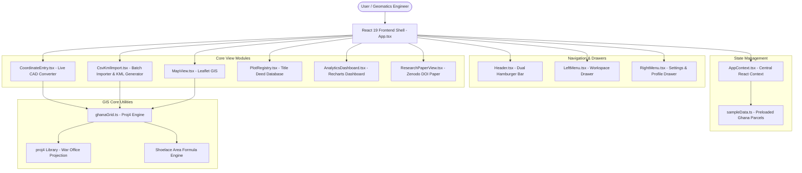
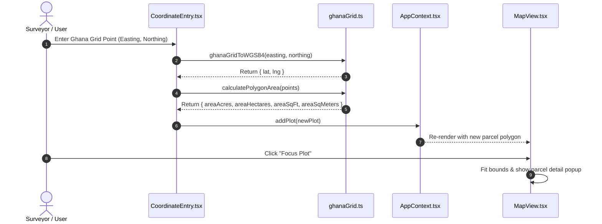

# 🇬🇭 Ghana Land Registry Management System

[](https://react.dev/)
[](https://www.typescriptlang.org/)
[](https://vitejs.dev/)
[](https://tailwindcss.com/)
[](https://leafletjs.com/)
[](https://github.com/proj4js/proj4js)
[](https://vitest.dev/)
[](https://tetteh-apotey-land-registry.vercel.app)

> 🚀 **Live Production Deployment**: [https://tetteh-apotey-land-registry.vercel.app](https://tetteh-apotey-land-registry.vercel.app)

A professional Cadastral Land Administration and GIS Web Application engineered specifically for Ghana's survey framework. Built on **React 19**, **TypeScript**, **Leaflet**, and **Proj4**, this application seamlessly integrates Ghana National Grid coordinates (War Office Transverse Mercator Projection) with modern WGS84 web mapping engines.

The platform directly incorporates empirical regional transformation algorithms and research findings from **Isaac Tetteh-Apotey's** landmark paper: *Bridging the Desktop-Mobile Divide: Regional Optimization of Ghana's National Grid for Mobile and Web Applications* ([Zenodo DOI: 10.5281/zenodo.18133088](https://zenodo.org/doi/10.5281/zenodo.18133088)).

---

## 🚀 Key Features

- **Ghana Grid Coordinate Conversion**: Bidirectional, real-time conversion between Ghana National Grid (Easting & Northing in Survey Feet, Gold Coast / Leigon Datum) and WGS84 (Latitude / Longitude).
- **War Office Transverse Mercator Projection**: Custom `proj4` projection definition configured with central meridian $1^\circ \text{W}$, origin latitude $4.669382^\circ \text{N}$, false easting $274,291.3\text{ m}$ ($900,000\text{ ft}$), and false northing $0\text{ m}$.
- **Interactive GIS Map (`MapView`)**: Multi-basemap Leaflet map support (Streets, Satellite Cadastral, Dark Canvas, Topographic Terrain) with interactive plot polygons, custom markers, popup infoboxes, and automatic boundary bounding-box zooming.
- **Manual Cadastral Entry (`CoordinateEntry`)**: Live real-time boundary polygon previewing while typing, automated land area calculations (Acres, Hectares, Sq Feet, Sq Meters using the Shoelace formula), and tenure metadata attachment.
- **CSV & Google Earth KML Import/Export (`CsvKmlImport`)**: Drag-and-drop batch loader for survey control points and site plans. Supports exporting individual or full-registry site plans to Google Earth KML format.
- **Land Parcel Registry & Tenure History (`PlotRegistry`)**: Searchable database of all registered land parcels, owner history tracking, deed references, and control point audits.
- **GIS Intelligence Analytics (`AnalyticsDashboard`)**: Interactive data visualization powered by Recharts, detailing land use distribution, tenure breakdowns, and regional acreage metrics.
- **Peer-Reviewed Research Portal (`ResearchPaperView`)**: Built-in access to Geomatics research detailing the $70\%$ accuracy improvement achieved across Greater Accra coastal zones.
- **Interactive Walkthrough & Standards Guide**: Step-by-step user guide modal (`UserGuideModal`) and GhIS/Ghana Lands Commission technical support modal (`SupportModal`).

---

## 📐 Architecture & Data Flow Diagrams

### 1. High-Level System Architecture



---

### 2. Ghana Grid Transformation Pipeline

```mermaid
flowchart LR
    A[Input: Ghana Grid Coordinates\nEasting ft / Northing ft] --> B[Datum: Gold Coast / Leigon\nEllipsoid: Clarke 1880]
    B --> C[Projection: War Office Transverse Mercator\nCentral Meridian: 1° W, Origin: 4.669382° N]
    C --> D[proj4 + Empirical Regional Shift Calibration]
    D --> E[Output: WGS84 Lat / Lng]
    
    E --> F[Leaflet Polygon Rendering]
    A --> G[Shoelace Polygon Area Engine]
    G --> H[Area Metrics:\nAcres | Hectares | Sq Ft | Sq Meters]
```

---

### 3. User Workflow & Data Interaction Sequence



---

## 📁 Project Structure & File Guide

```
├── .env.example              # Template for environment configuration variables
├── .gitignore                # Excluded files and directories for Git version control
├── assets/                   # Static assets directory
├── bun.lock                  # Lockfile for Bun package manager
├── index.html                # HTML entry point with Leaflet CSS CDNs & Google Fonts
├── metadata.json             # Applet metadata (Name, Description, Major Capabilities)
├── package.json              # Project dependencies, scripts, and build settings
├── tsconfig.json             # TypeScript compiler options & JSX config
├── vite.config.ts            # Vite bundler setup with Tailwind CSS plugin
└── src/                      # Source code root
    ├── App.tsx               # Main application component & tab router
    ├── index.css             # Global Tailwind CSS imports & theme directives
    ├── main.tsx              # React DOM root renderer
    ├── types.ts              # Global TypeScript interfaces & data type definitions
    ├── components/           # UI Component collection
    │   ├── AnalyticsDashboard.tsx  # Recharts GIS distribution charts
    │   ├── CoordinateEntry.tsx     # Cadastral coordinate converter & parcel creator
    │   ├── CsvKmlImport.tsx        # CSV file loader & Google Earth KML exporter
    │   ├── Header.tsx              # Application header bar with dual menu toggles
    │   ├── LeftMenu.tsx            # Left navigation drawer for workspace tools
    │   ├── MapView.tsx             # Interactive Leaflet map with custom basemaps
    │   ├── PlotRegistry.tsx        # Title deed database table with owner audit
    │   ├── ResearchPaperView.tsx   # Tetteh-Apotey research paper overview & DOI link
    │   ├── RightMenu.tsx           # Right drawer for profile, theme, & settings
    │   ├── SupportModal.tsx        # Ghana surveying standards guide & contact info
    │   └── UserGuideModal.tsx      # Interactive step-by-step onboarding modal
    ├── context/
    │   └── AppContext.tsx    # Global React Context provider managing app state
    └── lib/
        ├── ghanaGrid.ts      # Core mathematical conversion & KML export logic
        └── sampleData.ts     # Pre-populated realistic Ghana land parcel records
```

### Detailed File Descriptions

#### Root Configuration Files
- **`.env.example`**: Defines environment variables required by the server or client applications.
- **`.gitignore`**: Specifies untracked files like `node_modules/`, `dist/`, and environment secrets to keep out of Git.
- **`index.html`**: Host page for the SPA. Includes Leaflet CSS stylesheet CDN links and font stylesheets.
- **`metadata.json`**: App manifest declaring the application name ("Ghana Land Registry Management System"), description, and platform capabilities.
- **`package.json`**: Lists npm dependencies (`react`, `leaflet`, `proj4`, `recharts`, `papaparse`, `lucide-react`, etc.) and dev scripts (`dev`, `build`, `preview`, `lint`).
- **`tsconfig.json`**: Configuration for TypeScript compiler, enforcing strict type checking and React JSX handling.
- **`vite.config.ts`**: Configures Vite as the build tool with `@tailwindcss/vite` plugin support.

#### Application Core (`/src`)
- **`App.tsx`**: Top-level application component. Wraps the app in `AppProvider`, renders the header, side drawers, active tab component (`map`, `manual-entry`, `csv-kml`, `registry`, `analytics`, `research`), and global modals.
- **`main.tsx`**: Mounts the React application tree onto the `#root` element in `index.html`.
- **`index.css`**: Tailwind CSS v4 entry point configured with `@import "tailwindcss";` and custom dark mode styling rules.
- **`types.ts`**: Defines TypeScript interfaces including `Plot`, `BoundaryPoint`, `LandOwner`, `OwnerHistoryItem`, `AttachedFile`, `LandUse`, `TenureType`, and `Region`.

#### Application State (`/src/context`)
- **`AppContext.tsx`**: Centralized React Context providing state management for plots, active navigation tabs, theme preferences (light/dark/gold/emerald/slate), basemap selection, search filters, modal toggles, and step-by-step walkthrough state.

#### Utility Libraries (`/src/lib`)
- **`ghanaGrid.ts`**: Mathematical engine housing:
  - `proj4` War Office Transverse Mercator projection definitions.
  - `ghanaGridToWGS84()`: Converts Ghana Grid Eastings/Northings in Survey Feet to WGS84 Latitude/Longitude.
  - `wgs84ToGhanaGrid()`: Inverse conversion from WGS84 Lat/Lng to Ghana Grid ft.
  - `calculatePolygonArea()`: Computes acreage, hectares, sq feet, and sq meters using Shoelace polygon triangulation.
  - `exportPlotToKML()` & `exportMultiplePlotsToKML()`: Formats cadastral spatial data into XML-compliant KML files for Google Earth.
- **`sampleData.ts`**: Initial seed data featuring real-world inspired Ghana land parcels in Spintex (Accra), Cantonments (Accra), Ahodwo (Kumasi), and Tamale.

#### UI Components (`/src/components`)
- **`AnalyticsDashboard.tsx`**: Recharts visual dashboard displaying land use pie charts, tenure type bar charts, total acreage counters, and regional density indicators.
- **`CoordinateEntry.tsx`**: Form component allowing surveyors to input boundary points in Ghana Grid ft or WGS84 Lat/Lng, preview the polygon live on an embedded mini-map, calculate area metrics instantly, and save parcels to the database.
- **`CsvKmlImport.tsx`**: Batch parser for uploaded CSV files containing survey control points or site plan coordinates. Offers single-click KML export for all registry parcels.
- **`Header.tsx`**: Navigation header displaying logo, active tab status, quick action buttons, and triggers for the left workspace drawer and right user profile drawer.
- **`LeftMenu.tsx`**: Slide-out drawer providing navigation links to all primary application modules (Map, Coordinate Entry, CSV/KML Loader, Registry, Analytics, Research).
- **`RightMenu.tsx`**: Slide-out drawer displaying version information, developer profile (Isaac Tetteh-Apotey), theme selection switches, and links to technical standards.
- **`MapView.tsx`**: Full-featured Leaflet GIS map with interactive basemap switches (OpenStreetMap, Esri World Imagery Satellite, CartoDB Dark, Topo), search filtering, polygon overlays, and parcel click inspector cards.
- **`PlotRegistry.tsx`**: Searchable tabular database of land parcels with owner history timeline modal, control point audit tables, and individual KML export triggers.
- **`ResearchPaperView.tsx`**: Dedicated view summarizing Isaac Tetteh-Apotey's peer-reviewed Geomatics research paper on Ghana Grid optimization, featuring key findings and Zenodo DOI access.
- **`SupportModal.tsx`**: Technical reference modal detailing Ghana Lands Commission Surveying Instructions, Gold Coast / Leigon datum parameters, and support contact details.
- **`UserGuideModal.tsx`**: Interactive 7-step guided walkthrough introducing new users to the system's core capabilities.

---

## 🛠️ How to Run the App Locally

### Prerequisites
- **Node.js**: Version `18.0.0` or higher
- **npm** or **bun** package manager

### Step-by-Step Local Setup

1. **Clone the repository**:
   ```bash
   git clone https://github.com/your-username/ghana-land-registry.git
   cd ghana-land-registry
   ```

2. **Install dependencies**:
   ```bash
   npm install
   ```

3. **Start the local development server**:
   ```bash
   npm run dev
   ```

4. **Access the application**:
   Open your browser and navigate to `http://localhost:3000`.

### Available Scripts

| Command | Action |
| :--- | :--- |
| `npm run dev` | Launches Vite dev server on port `3000` |
| `npm run build` | Compiles production assets into `dist/` |
| `npm run preview` | Serves the production build locally for verification |
| `npm run lint` | Runs TypeScript type checking (`tsc --noEmit`) |
| `npm run clean` | Cleans build artifacts (`dist/`) |

---

## ☁️ Deployment

### Static Hosting (Vercel, Netlify, GitHub Pages, Cloud Run)

This application compiles to a static Single-Page Application (SPA) in the `dist/` folder.

1. **Build the production distribution**:
   ```bash
   npm run build
   ```

2. **Deploy `dist/` folder**:
   - **Vercel**: Push your repo to GitHub and import it directly into Vercel. Output directory is automatically detected as `dist`.
   - **Netlify**: Connect your repository and set build command to `npm run build` and publish directory to `dist`.
   - **Docker / Cloud Run**: Serve the static `dist/` folder using Nginx or Caddy.

---

## 📜 Research & Standards Compliance

### Primary Research Reference
- **Title**: *Bridging the Desktop-Mobile Divide: Regional Optimization of Ghana's National Grid for Mobile and Web Applications*
- **Author**: Isaac Tetteh-Apotey (Geomatics Engineer & Software Developer, GhIS Member)
- **DOI**: [10.5281/zenodo.18133088](https://zenodo.org/doi/10.5281/zenodo.18133088)

### Ghana Surveying Standards
- **Datum**: Gold Coast / Leigon (Clarke 1880 Ellipsoid, $a = 6378249.145\text{ m}$, $1/f = 293.465$)
- **Projection**: War Office Transverse Mercator
- **Central Meridian**: $1^\circ \text{W} \quad (-1.0^\circ)$
- **Latitude of Origin**: $4.669382^\circ \text{N} \quad (+4^\circ 40' 09.775" \text{N})$
- **False Easting**: $274,291.3\text{ m} \quad (900,000\text{ ft})$
- **False Northing**: $0\text{ m}$
- **Unit**: Ghana Survey Feet ($1\text{ ft} = 0.30480061\text{ m}$)

---

## 📄 License

This project is released under the **MIT License**.
